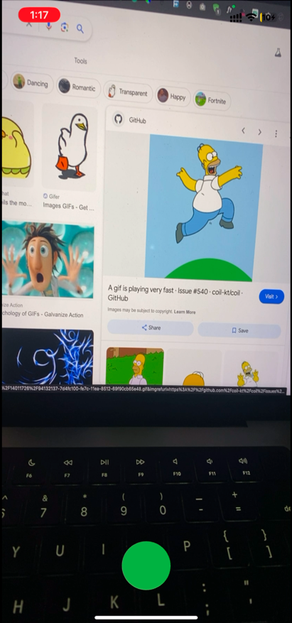

# Inspired by GPT4-o release demo

Hold the button and ask questions about the environment

## Checkout the `video demo` <a href='https://youtu.be/yH30449mNc8'>here</a>



**VIDEO DEMO**: <a href='https://youtu.be/yH30449mNc8'>Link</a>

# Build and Install

- create a .env file at the root:

```env
OPEN_AI_API_KEY=""
```

- run `flutter pub get`
- run `dart run build_runner build`
- run `flutter run` or `flutter build ios`
